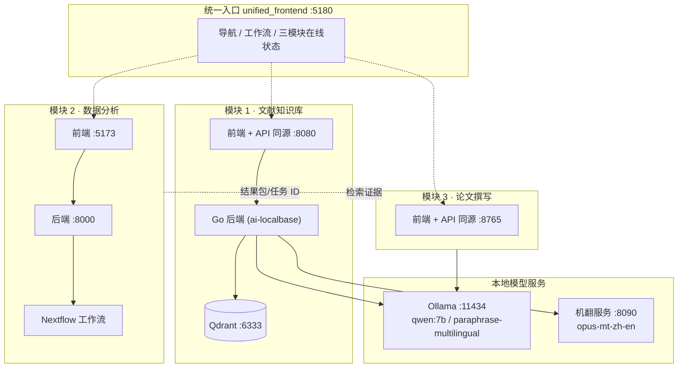
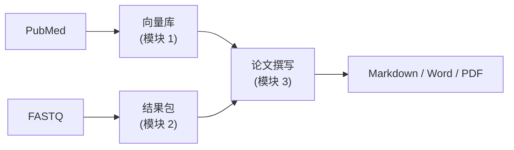

# BioFlow · 模块化生物信息学科研工作流

> 从文献发现 → 微生物组分析 → 论文成稿，把分散的科研动作串成一条可追溯的工作路径。
> 全部组件可本地部署、独立运行，也可通过统一入口串成完整流水线。

BioFlow 面向「自闭症谱系障碍（ASD）× 肠道菌群」这类研究场景，把 **文献检索与知识库**、**宏基因组下游分析**、**科研论文撰写** 三个环节拆成独立模块，各自拥有自己的前后端；再用一个统一入口把三者串起来，并用 `bioflow` 核心完成模块编排与证据流转。

---

## 一、组成部分及功能

| # | 模块 | 目录 | 职责 | 技术栈 |
|---|---|---|---|---|
| 1 | **文献知识库** | `Article_repository/` | PubMed 文献抓取 → 元数据标签化 → 向量化入库 → RAG 检索问答 | Python / FastAPI，Go + Gin（`ai-localbase` 后端），React + Vite，Qdrant |
| 2 | **数据分析** | `BioLLM_RawDataAnalysis/` | 宏基因组原始数据（FASTQ）质控、物种注释、功能注释与结果打包 | Python / FastAPI，Nextflow 工作流，React + Vite |
| 3 | **论文撰写** | `article_writing/` | 汇总分析结果与文献证据，生成七章 IMRaD 初稿，逐章审阅确认并导出 | Python / FastAPI，本地 Ollama LLM，原生 JS 前端 |
| 4 | **技能库** | `bioflow_skills/` | 论文写作规范技能包（拆分自 openskills），供撰写模块按需调用 | Markdown 技能定义 + Python 加载器 |
| 5 | **统一入口** | `unified_frontend/` | 统一导航、工作流概览、三模块在线状态检测 | React 19 + Vite 7 + TypeScript |
| 6 | **编排核心** | `bioflow/`、`bioflow_ml/` | 模块注册表、依赖调度器、可插拔运行器、证据索引 | Python，Typer CLI + FastAPI，Pydantic |
| 7 | **历史 RAG 实现** | `RAG/` | 早期本地文档库 + PubMed 的混合检索实现，已被模块 1 取代，保留作参考 | Python，Chroma |

### 1.1 文献知识库（`Article_repository/`）

- **抓取**：`sync_and_upload.py` 支持三种模式 —— `test_full`（小样本全量试跑）、`official_full`（正式全量初始化）、`incremental`（增量补充）。
- **入库**：文献元数据（标题 / 作者 / 期刊 / DOI / 关键词）作为**标签索引**，全文或摘要作为**正文**进入向量库；两者分离，检索结果里不会再混入元数据标签。
- **向量库 `ai-localbase`**（`Article_repository/ai-localbase/`）：Go + Gin 后端 + React 前端 + Qdrant，**前端与 API 同源在 8080 端口**。
- **切分策略**：基于 embedding 语义相似度切分，目标 450 字符上下浮动，优先在语义边界切分（不拼接不同段、不切断句子）。
- **检索**：中文提问 → 本地机翻转英文检索式 → 稠密 + 稀疏 + BM25 三路召回 → RRF 融合 → cross-encoder 重排 → 大模型**用中文作答**。

### 1.2 数据分析（`BioLLM_RawDataAnalysis/`）

- 上传 FASTQ → 创建分析任务 → 查看进度与日志 → 产出结果包（ResultBundle）。
- `workflow/` 下为 Nextflow 工作流，`config/database-registry.local.json` 描述参考数据库位置（需按部署环境调整）。
- 后端 `:8000`（默认仅监听本机），前端 `:5173`（Vite，把 `/api` 代理到后端）。

### 1.3 论文撰写（`article_writing/`）

- 「素材接入」填入分析任务 ID / 结果目录 / 结果包路径，并预览文献命中。
- 「LLM 设置」可在页面上切换模型；保存前会校验模型是否真实存在。
- 生成七章初稿 → 逐章编辑 / 润色 → 逐章确认 → 导出 Markdown / Word / PDF（Word / PDF 依赖 LibreOffice）。
- 文献检索通过 `AILocalBaseLiteraturePort` 直连模块 1 的向量库；作者与年份缺失时用 Crossref 补齐。

### 1.4 统一入口（`unified_frontend/`）

只负责导航与状态概览，不复制各模块前端。三个模块链接由**浏览器当前主机名**推导，因此用 IP 或域名访问都能正确跳转。

---

## 二、系统架构



**端到端流程**



---

## 三、仓库结构

```
BioFlow/
├── Article_repository/          模块 1 · 文献抓取 + 向量知识库
│   ├── article_repository/      FastAPI 服务与仓储层
│   ├── ai-localbase/            Go 后端 + React 前端 + Qdrant 编排
│   ├── scripts/                 机翻服务、前端构建等辅助脚本
│   ├── liter/                   Ollama 容器桥接脚本
│   └── sync_and_upload.py       抓取并上传向量库的 CLI 入口
│
├── BioLLM_RawDataAnalysis/      模块 2 · 宏基因组分析
│   ├── backend/                 FastAPI 服务
│   ├── workflow/                Nextflow 工作流
│   ├── frontend/                React + Vite 前端
│   └── scripts/                 前后端启停脚本
│
├── article_writing/             模块 3 · 论文撰写
│   ├── article_writing/         流水线、适配器、LLM 封装
│   ├── frontend/                FastAPI 服务 + 静态前端
│   └── fixtures/                演示与测试夹具
│
├── bioflow_skills/              模块 4 · 写作技能库
├── unified_frontend/            统一入口（React + Vite）
├── bioflow/                     编排核心（注册表 / 调度器 / 运行器）
├── bioflow_ml/                  机器学习相关模块
├── RAG/                         历史 RAG 实现（参考）
├── scripts/start_services.sh    一键启动全部服务
├── config/example.yaml          运行时配置示例
├── data/mock/                   测试夹具
└── tests/                       核心模块测试
```

---

## 四、环境要求

| 依赖 | 版本 / 说明 |
|---|---|
| Python | 3.10+（论文撰写与文献模块建议独立虚拟环境） |
| Node.js | 20+（三个前端 + 统一入口） |
| Go | 1.25+（`ai-localbase` 后端） |
| Docker + Compose | 运行 Qdrant 与 ai-localbase |
| Ollama | 本地大模型与向量模型服务 |
| LibreOffice | 导出 Word / PDF（`soffice`） |
| Nextflow | 仅在跑真实宏基因组分析时需要 |

**Ollama 需要拉取的模型**

```bash
ollama pull qwen:7b                      # 对话 / 写作（CPU 可跑）
ollama pull paraphrase-multilingual      # 768 维多语言向量
```

> 若服务器无 GPU，`qwen:7b` 即可；更大的模型（如 `qwen3:14b`）在 CPU 上会超时。

---

## 五、安装

```bash
git clone git@github.com:Carbonsteel2749/BioFlow.git
cd BioFlow
```

**各模块依赖分开安装：**

```bash
# 模块 1 · 文献知识库
cd Article_repository && pip install -r pip_install.txt
cd ai-localbase && docker compose -f docker-compose.dev.yml up -d --build && cd ../..

# 模块 2 · 数据分析
cd BioLLM_RawDataAnalysis/frontend && npm install && cd ../..

# 模块 3 · 论文撰写
cd article_writing && python3 -m venv .venv && .venv/bin/pip install -e . && cd ..

# 统一入口
cd unified_frontend && npm install && npm run build && cd ..

# 机翻服务（可复用同一虚拟环境）
pip install fastapi uvicorn transformers sentencepiece torch
```

**配置**：各模块的 `.env` 需要按自己的环境创建（本仓库只提供 `.env.example` 模板，**不含任何真实凭据**）：

| 模板文件 | 用途 |
|---|---|
| `Article_repository/.env.example` | NCBI API Key、ai-localbase 知识库 ID / 名称 |
| `Article_repository/ai-localbase/.env.example` | 端口、鉴权、Qdrant、Ollama、检索引擎开关 |
| `unified_frontend/.env.example` | 统一入口端口与各模块地址覆盖 |

```bash
cp Article_repository/.env.example Article_repository/.env
cp Article_repository/ai-localbase/.env.example Article_repository/ai-localbase/.env
# 然后按需填写
```

---

## 六、启动方式

### 6.1 一键启动

```bash
bash scripts/start_services.sh
```

脚本是**幂等**的：已在运行的服务会跳过，可重复执行。执行完毕会打印各服务健康状态与访问地址。
它负责启动：机翻 `:8090`、论文撰写 `:8765`、分析后端 `:8000`、分析前端 `:5173`、统一入口 `:5180`。

文献知识库（Qdrant + ai-localbase）由 Docker Compose 管理，单独拉起：

```bash
cd Article_repository/ai-localbase
docker compose -f docker-compose.dev.yml up -d
```

### 6.2 服务与端口总览

| 服务 | 端口 | 监听 | 说明 |
|---|---|---|---|
| **统一入口（研究工作台）** | 5180 | 对外 | 从这里进入，跳转各模块 |
| 文献知识库 ai-localbase | 8080 | 对外 | 前端与 API **同源** |
| 数据分析前端 | 5173 | 对外 | Vite，`/api` 代理到 8000 |
| 数据分析后端 | 8000 | 仅本机 | uvicorn，不直接对外 |
| 论文撰写 | 8765 | 对外 | 前端 + API 同源 |
| 中→英机翻服务 | 8090 | 仅本机 | 检索查询翻译 |
| Ollama | 11434 | 仅本机 | chat / embedding |
| Ollama 容器桥接 | 11435 | 仅本机 | 供 Docker 容器访问宿主机 Ollama |
| Qdrant | 6333 / 6334 | 仅本机 | 向量库 |

### 6.3 打开统一入口

地址：**`http://<服务器IP>:5180/`**，右上角显示 `N/3 个服务在线`。

> ⚠️ **不要用 `127.0.0.1` 打开统一入口。**
> 模块链接由浏览器当前主机名推导（`unified_frontend/src/main.tsx` 的 `moduleUrl()`），用 IP / 域名访问会自动指向同一台服务器；用 `127.0.0.1` 打开则子模块链接会指向**你自己电脑**的 127.0.0.1。

访问方式对比：

| 方式 | 做法 | 注意 |
|---|---|---|
| **服务器 IP（推荐）** | `http://<IP>:5180/` | 对外服务已绑 `0.0.0.0` |
| VS Code 端口面板 | PORTS → Forward a Port，依次转发 5180 / 8765 / 8080 / 5173 | 看 **Forwarded Address** 列；本地端口需与远端一致 |
| SSH 隧道 | 在**本地**终端执行 `ssh -N -L 5180:127.0.0.1:5180 -L 8765:127.0.0.1:8765 -L 8080:127.0.0.1:8080 -L 5173:127.0.0.1:5173 user@<服务器IP>` | 必须在**本地**跑；在服务器上跑会因端口被服务自身占用而报 `bind: Address already in use` |

### 6.4 分模块启动

```bash
# 文献知识库
cd Article_repository/ai-localbase && docker compose -f docker-compose.dev.yml up -d

# 数据分析
cd BioLLM_RawDataAnalysis && bash scripts/run_backend.sh                    # :8000
BIOLLM_FRONTEND_HOST=0.0.0.0 bash scripts/run_frontend.sh                    # :5173

# 论文撰写
cd article_writing && PYTHONPATH=. python -m uvicorn frontend.server:app --host 0.0.0.0 --port 8765

# 统一入口
cd unified_frontend && npx vite preview --host 0.0.0.0 --port 5180
```

---

## 七、端到端使用流程

1. **启动并确认服务**：`bash scripts/start_services.sh`，六项均为 `OK`；打开统一入口确认 `3/3 个服务在线`。
2. **文献入库**（`:8080`）：创建知识库 → 触发 PubMed 抓取 → 元数据作标签、全文作正文入库。
   ```bash
   cd Article_repository
   python3 sync_and_upload.py --mode incremental --retmax 20 --kb-name <知识库名>
   ```
3. **数据分析**（`:5173`）：上传 FASTQ → 创建任务 → 等待完成 → 记下**任务 ID**或**结果包路径**。
4. **生成论文**（`:8765`）：素材接入 → 确认 LLM 设置 → 生成七章 → 逐章确认 → 导出。
5. **检索问答**：在文献知识库中直接用中文提问，系统内部转英文检索后以中文作答。

---

## 八、编排核心（`bioflow/`）

除三个独立前端模块外，仓库还包含一个可编程的编排核心，用于把模块串成流水线。

```bash
# CLI
python -m bioflow.cli.main list-modules
python -m bioflow.cli.main run-module analysis
python -m bioflow.cli.main run-all

# HTTP API
uvicorn bioflow.api.app:app --port 8008
```

关键设计：

- **模块隔离**：每个模块声明输入 / 输出契约，可独立运行。
- **确定性产物**：产物、日志与证据写入 `runs/<run_id>/`，路径可预测。
- **可插拔运行器**：`runners/mock.py` 用于无重型计算的本地开发，`runners/nextflow.py` 用于真实执行。
- **安全 LLM 使用**：提示词先经脱敏规则处理，仅在严格规则下允许外部模型。
- **配置**：`config/example.yaml` 中的 `models.ollama.url` 与 `rag.url` 被 CLI / API / 结果分析共享。

---

## 九、测试

```bash
# 论文撰写模块
cd article_writing && .venv/bin/python -m pytest

# 编排核心
python -m pytest tests/

# 向量库后端
cd Article_repository/ai-localbase/backend && go test ./...
```

---

## 十、关于本仓库的数据与凭据

为避免公开泄露，以下内容**已被刻意排除**，请在你自己的环境中生成：

| 排除项 | 说明 |
|---|---|
| `**/.env` | 含 NCBI API Key、JWT 密钥、数据库口令等；仅保留 `.env.example` 模板 |
| `Article_repository/ai-localbase/qdrant` | Qdrant 可执行二进制（约 73 MB） |
| `ai-localbase/qdrant_storage/`、`chroma_db/` | 向量库数据目录 |
| `ai-localbase/backend/data/`、`article_writing/outputs/`、`BioLLM_RawDataAnalysis/{runtime,results,work}/` | 运行时状态、会话与结果产物 |
| `node_modules/`、`.venv/`、`dist/`、`__pycache__/`、`*.egg-info/` | 依赖与构建产物 |
| `*.sqlite3`、`*.db` | 本地数据库文件 |
| `BioLLM_RawDataAnalysis/report-*.html` | 分析报告快照 |
| 参考数据库 | 宿主基因组建索引、Kraken2 / HUMAnN / MetaPhlAn 库等（体积以 TB 计），需按 `BioLLM_RawDataAnalysis/config/` 自行准备 |

> 请勿把真实凭据提交到本仓库。首次运行前，用 `.env.example` 生成自己的 `.env`。

---

## 十一、常见问题

| 现象 | 原因 / 处理 |
|---|---|
| 统一入口显示某模块「离线」 | 模块未启动或只绑了 `127.0.0.1`；跑一键启动脚本，确认对外的是 `5173` 而不是 8000 |
| 「打开模块」跳到 `127.0.0.1:端口` | 用 `127.0.0.1` 打开了统一入口，改用服务器 IP 或域名 |
| 论文撰写提示模型不可用 | `ollama list` 确认模型已拉取；在页面「LLM 设置」重新保存 |
| 生成内容被截断 / 只出英文 | Ollama `num_ctx` 偏小；项目默认 `num_ctx=8192`，若改过配置请确认 |
| 容器里访问不到 Ollama | 容器需经宿主机桥接脚本（`Article_repository/liter/ollama_proxy_11435.py`，监听 `0.0.0.0:11435`） |
| 导出 Word / PDF 失败 | 未安装 LibreOffice，或 `soffice` 不在 PATH |
| Qdrant 连接失败 | 容器未启动；`docker compose -f docker-compose.dev.yml up -d` |

---

## 十二、许可与致谢

本项目为科研用途的本地化工作台。文献数据来源于 PubMed，向量检索基于 Qdrant，大模型与向量模型由 Ollama 本地托管。
`bioflow_skills/` 中的写作技能规范整理自 openskills 相关实践。

使用前请自行确认各上游数据源与依赖库的许可条款。
